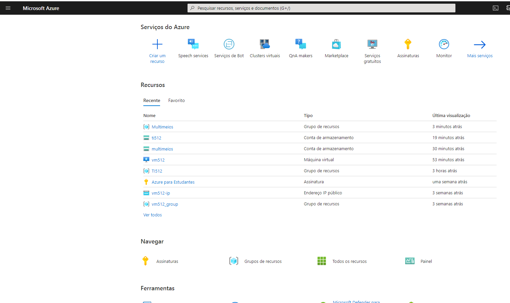
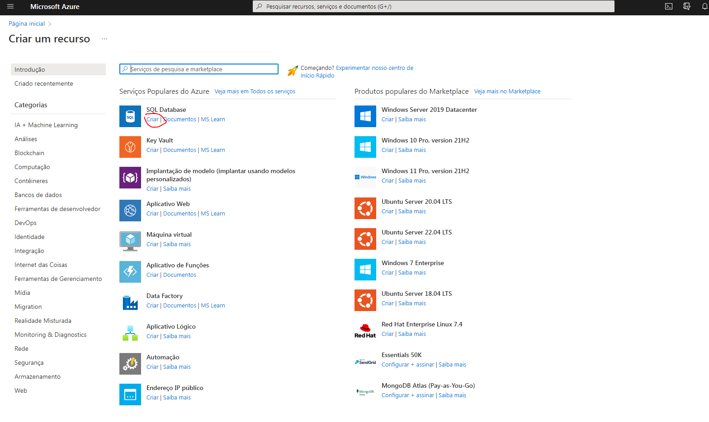
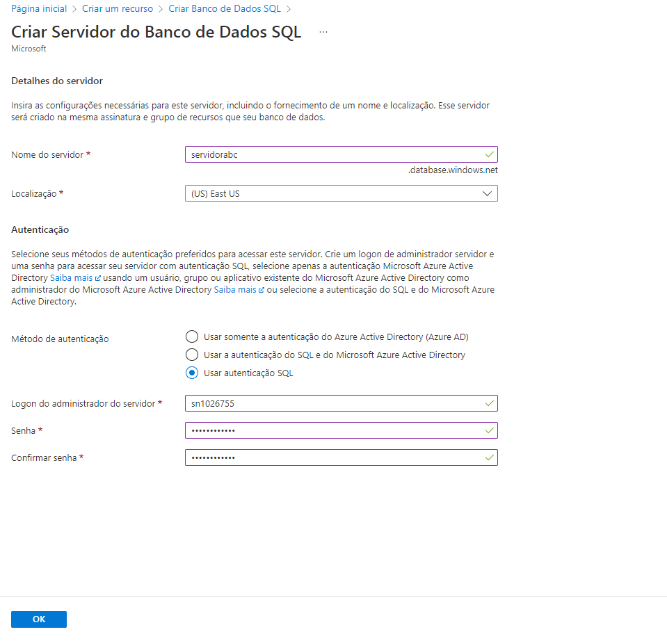
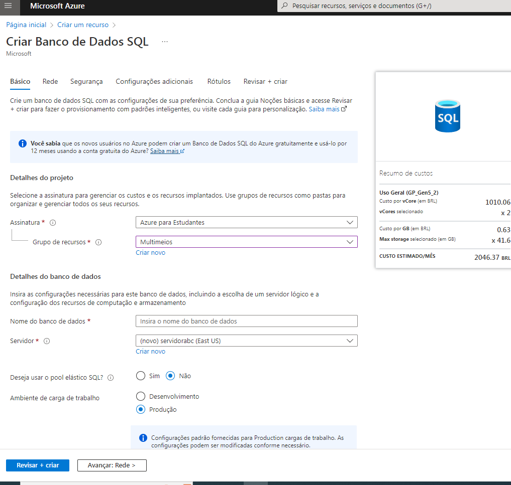
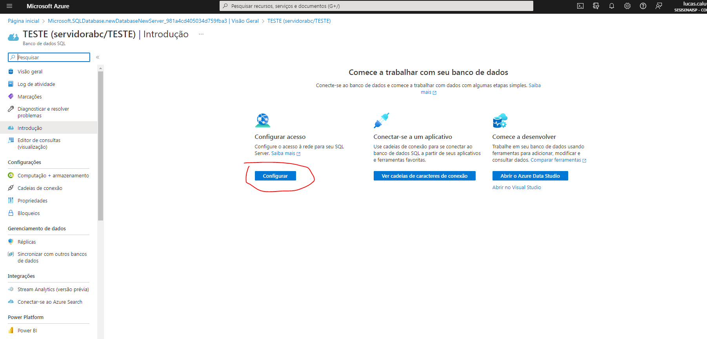
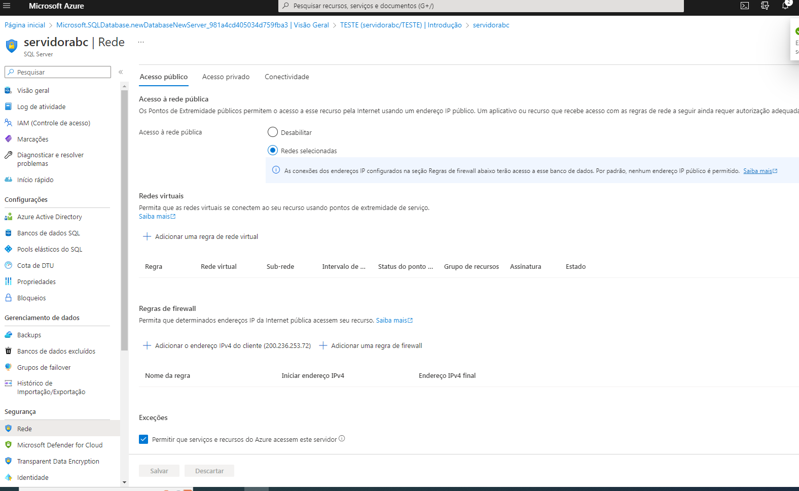
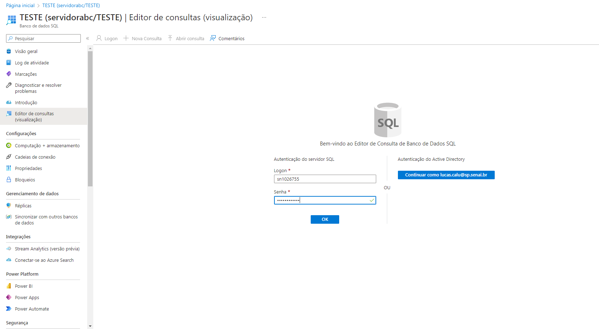

# AZ-900-CREATE-SQL-DATABASE

CLIQUE EM CRIAR RECURSO

PROCURE POR SQL DATABASE E CLIQUE EM CRIAR

PREENCHA OS PROXIMOS CAMPOS NÃO ESQUECENDO DE CRIAR O SERVIDOR PARA O BANCO DE DADOS E CLIQUE EM REVISAR E CRIAR

CLIQUE EM CONFIGURAR ACESSO

FAÇA ACESSO COM O EDITOR DE CONSULTAS

